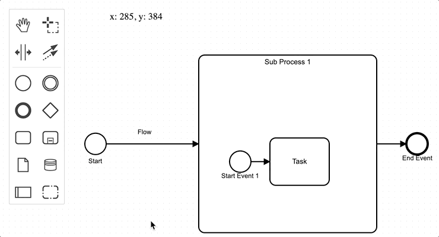

# bpmn-js-honkify

bpmn-js extension which is inspired by [honkify](https://github.com/jlengstorf/honkify).

➡[**Try out on netlify**](https://bpmn-js-honkify.netlify.com/)

Turn your Audio on to hear the honk(s)! 🦆

## Installation

```sh
$ npm i --save bpmn-js-honkify
```



Checkout the [**Example**](./example/) for further instructions.

## Usage
```js
import BpmnModeler from 'bpmn-js/lib/Modeler';

import honkifyModule from 'bpmn-js-honkify';

var modeler = new BpmnModeler({
  // ...
  additionalModules: [
    honkifyModule
  ]
});

```

