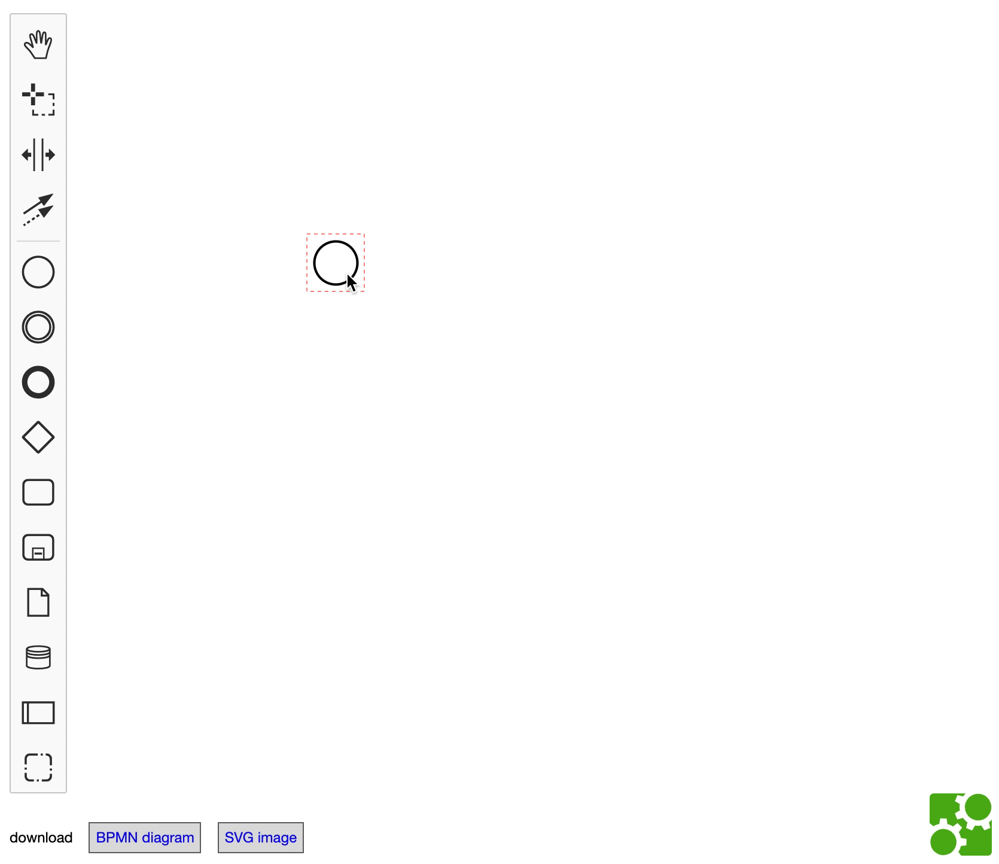

# bpmn-js-honkify

bpmn-js extension which is inspired by [honkify](https://github.com/jlengstorf/honkify)



## Installation

```sh
$ npm i --save bpmn-js-honkify
```

## Usage
```js
import BpmnModeler from 'bpmn-js/lib/Modeler';

import honkifyModule from 'bpmn-js-honkify';

var modeler = new BpmnModeler({
  // ...
  additionalModules: [
    honkifyModule
  ]
});

```

